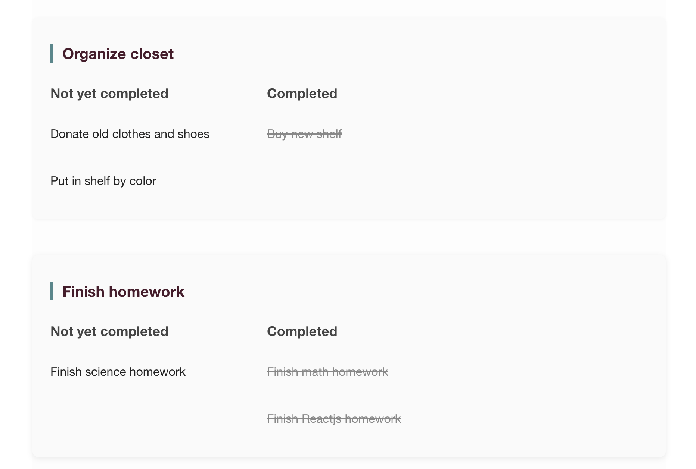
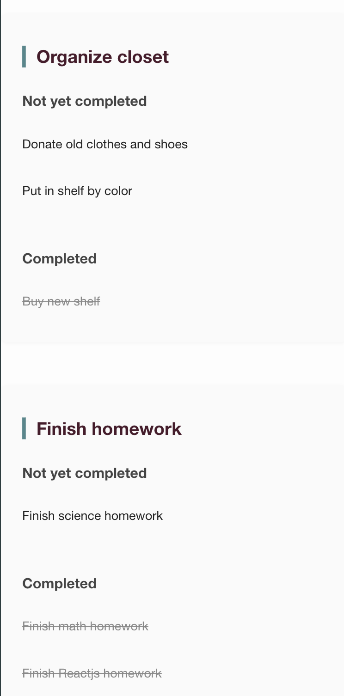

# List Organizer React App

A simple React app for organizing tasks into categories with toggleable completion status.

---

## Live Demo

[Live Demo Link Here](https://list-organizer-react.vercel.app/)

---

## Screenshots

### Desktop View



### Mobile View



---

## Features

- Categorize tasks for better organization.
- Toggle subtasks between **Not yet completed** and **Completed** by clicking.
- Responsive and clean UI.
- State management handled with React hooks.
- Separate components for maintainability.

---

## Project Structure

```
src/
├── components/
│ ├── Checklist/
│ │ ├── Checklist.jsx
│ │ └── Checklist.css
│ └── Subtask/
│ ├── Subtask.jsx
│ └── Subtask.css
├── data/
│ └── initialList.js
└── App.js
```

---

## How It Works

1. The app loads initial task categories and subtasks from `initialList.js`.
2. `Checklist` component manages the task state.
3. Clicking a subtask toggles its completion status.
4. Completed and pending tasks display in separate columns.

---

## Getting Started

1. Clone the repository:

   ```bash
   git clone https://github.com/maria-an11/list-organizer-react.git

   ```

2. Install dependencies:

   ```bash
    npm install

   ```

3. Start the development server:

   ```bash
   npm start

   ```

4. Open http://localhost:3000 in your browser.
